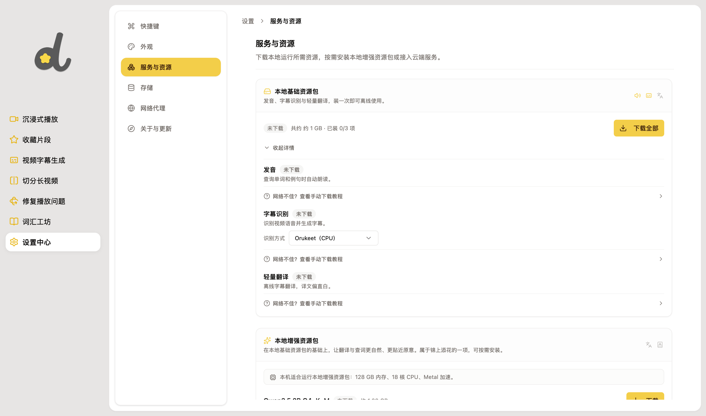

# Orukeet 本地字幕

在「设置中心 → 服务与资源 → 查看详情」的识别方式中选择 **Orukeet（CPU）**，再下载字幕模型。它使用现有 sherpa-onnx 引擎，模型目录独立于 Parakeet，切换选项不会删除已安装模型。

模型从 [Hugging Face](https://huggingface.co/oruk/orukeet) 的固定版本下载。安装器校验官方 JSON 清单和归档的 SHA256，保留权重许可与署名；JSON 清单请求纳入 Hugging Face 的正常下载统计。下载约 487 MB，解压后约 672 MB。识别在本地运行，模型安装后可离线使用。

Orukeet v0.1.0 基于 Parakeet TDT v3，支持模型卡列出的 25 种欧洲语言；DashPlayer 的字幕学习流程仍以英语为主。权重许可为 CC BY-SA 4.0。此选项沿用现有分块识别、子词时间戳和取消流程，不提供实时流式识别。
